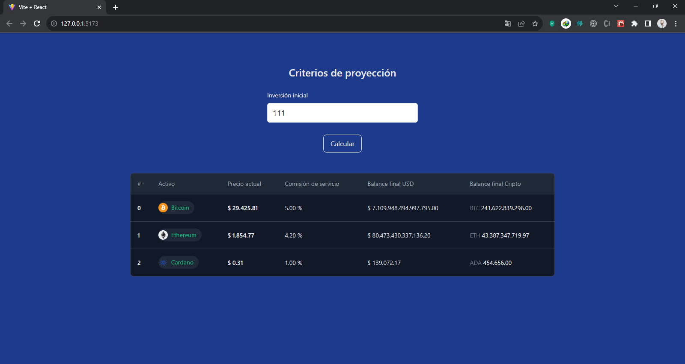
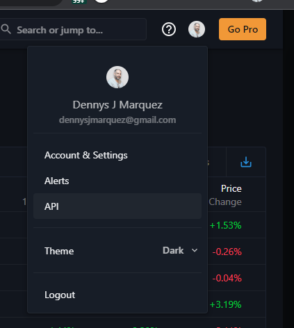

# Desafio de Disruptive studio

## Descripción

#### Calculadora de Inversión en Criptomonedas

Esta es una aplicación web que permite a los usuarios definir un balance en dólares para invertir en Bitcoin, Ethereum y
Cardano. La aplicación calcula la ganancia anual para cada moneda, asumiendo que Bitcoin tiene un retorno mensual del
5%, Ethereum tiene un retorno mensual del 4.2% y Cardano tiene un retorno mensual del 1%.

Además, la aplicación muestra el balance proyectado final del monto invertido y su equivalente en cripto. También
incluye una tabla actualizada con información sobre las 3 criptomonedas

## Cómo usar la aplicación

Para usar la aplicación, simplemente ingresa el balance que deseas invertir y haz clic en el botón "Calcular". La
aplicación mostrará la ganancia anual y el balance proyectado de cada inversión.

## Tecnologías utilizadas

La aplicación fue desarrollada utilizando HTML, CSS, React, Node.js, Express.js, Tailwind Css, axios.

### Instalación

1. Para obtener el código de la aplicación, puedes descargar el repositorio de Github utilizando la opción de descarga o hacer un fork del repositorio si deseas realizar cambios en el código. El repositorio contiene tanto el servidor como el cliente de la aplicación.

Es importante tener en cuenta que hay dos carpetas en el repositorio: una para el cliente y otra para el servidor. Ambas carpetas tienen un archivo package.json, que contiene la lista de dependencias necesarias para que la aplicación funcione correctamente.

Para instalar estas dependencias, es necesario entrar en la raíz de cada carpeta del servidor y el cliente y ejecutar el comando `yarn` o `npm install` para instalar en la terminal. Esto asegurará que todas las dependencias necesarias se instalen correctamente y la aplicación pueda funcionar sin problemas.

2. 

3. `yarn start` o `npm start` para inicializar el Server
4. `yarn dev` o `npm dev` para inicializar la App
6. Ambas aplicaciones tienen un archivo .env para definir variables de entorno. En el cliente, se debe establecer la variable VITE_SERVER_URL con la URL del servidor. Por ejemplo: VITE_SERVER_URL=http://localhost:5000.

En el servidor, se requiere la API key de Messari para que la aplicación funcione correctamente. Para obtener una API key, es necesario registrarse en https://messari.io/ y generarla en la cuenta del usuario. Luego, se debe agregar la API key al archivo .env en el servidor. Por ejemplo: MESSARI_API_KEY={aquí va la API key}

Es importante agregar la API key de Messari al archivo .env del servidor, de lo contrario, la aplicación no funcionará. Obtener una API key es fácil y gratuito, solo se necesita registrarse en la página de Messari y generar una clave en la sección de API de la cuenta del usuario. 

7. Finalmente, abra su navegador web y visite la dirección http://127.0.0.1:5173/ para ver la aplicación en
   funcionamiento.

-- END --
